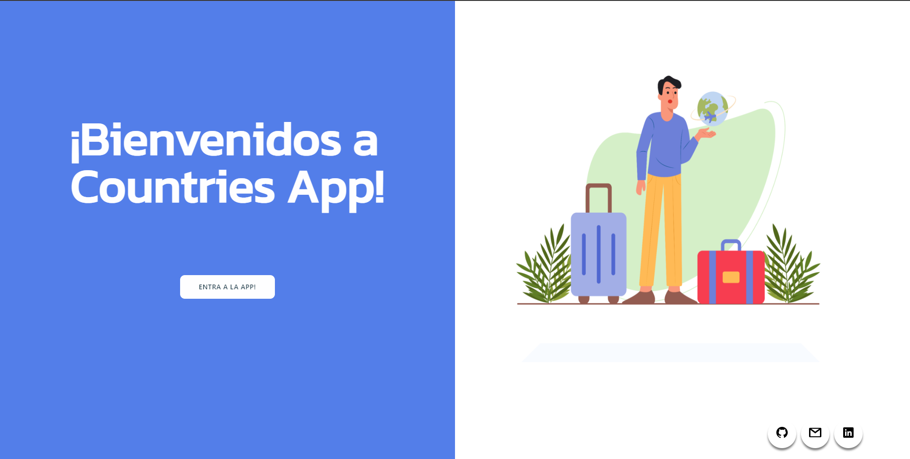
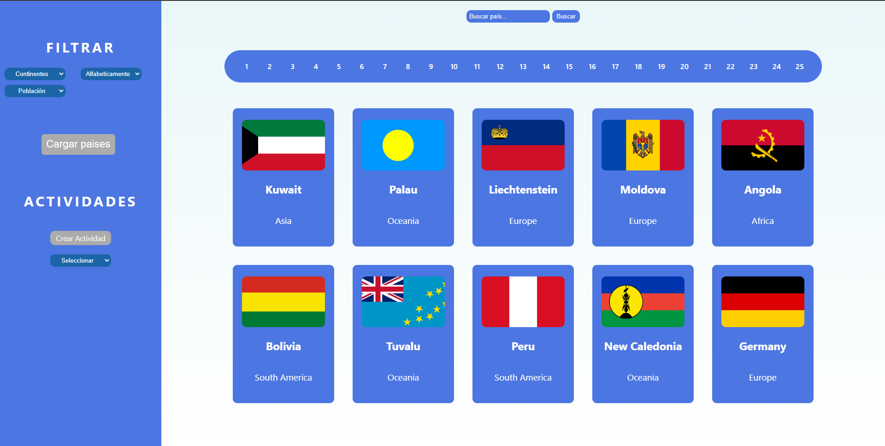
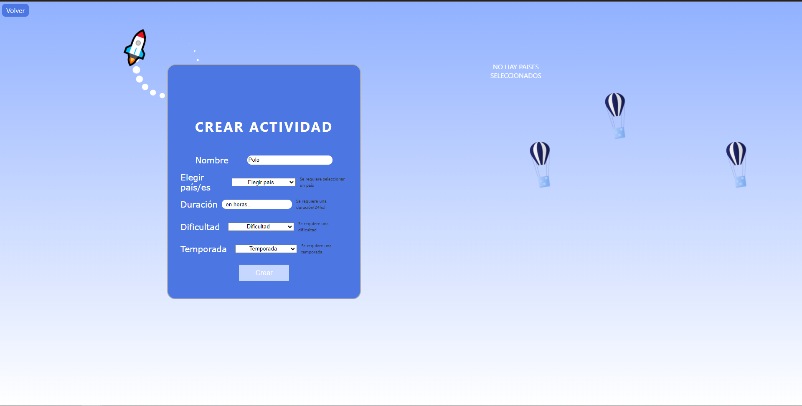
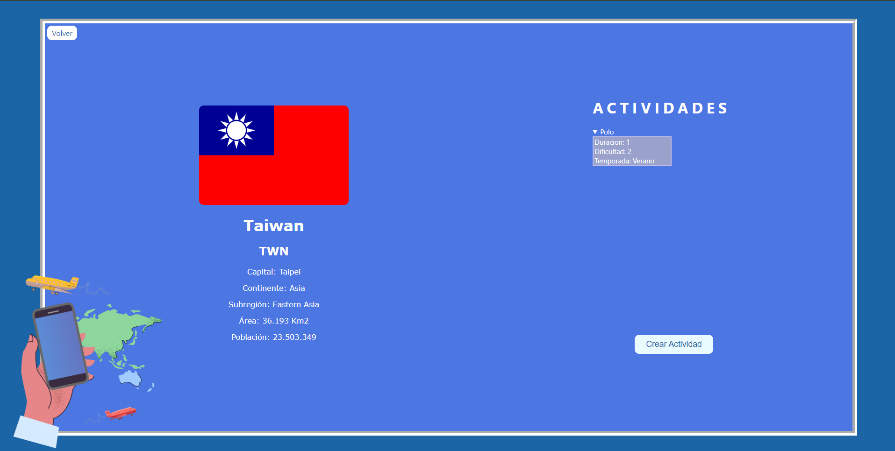

## Comenzando

 1. Forkear el repositorio para tener una copia del mismo en sus cuentas.
 2. Clonar el repositorio en sus computadoras para comenzar a trabajar.

Tendrán un `boilerplate` con la estructura general tanto del servidor como de cliente.

__IMPORTANTE:__ Es necesario contar minimamente con la última versión estable de Node y NPM. Asegurarse de contar con ella para poder instalar correctamente las dependecias necesarias para correr el proyecto.

Actualmente las versiónes necesarias son:

- __Node__: 12.18.3 o mayor
- __NPM__: 6.14.16 o mayor

Para verificar que versión tienen instalada:

```bash
node -v
npm -v
```

Versiones:

- __react__: 17.0.1
- __react-dom__: 17.0.1
- __react-router-dom__: 5.2.0
- __redux__: 4.0.5
- __react-redux__: 7.2.3


## BoilerPlate

El boilerplate cuenta con dos carpetas: `api` y `client`. En estas carpetas estará el código del back-end y el front-end respectivamente.

En `api` crear un archivo llamado: `.env` que tenga la siguiente forma:

```env
DB_USER=usuariodepostgres
DB_PASSWORD=passwordDePostgres
DB_HOST=localhost
```

Reemplazar `usuariodepostgres` y `passwordDePostgres` con tus propias credenciales para conectarte a postgres. Este archivo va ser ignorado en la subida a github, ya que contiene información sensible (las credenciales).

Adicionalmente será necesario que creen desde psql una base de datos llamada `countries`

El contenido de `client` fue creado usando: Create React App.

## Enunciado

La idea general es crear una aplicación en la cual se pueda ver información de  distintos paises utilizando la api externa [restcountries](https://restcountries.com/) y a partir de ella poder, entre otras cosas:

- Buscar paises
- Filtrarlos / Ordenarlos
- Crear actividades turísticas

#### Tecnologías 

- [ ] React
- [ ] Redux
- [ ] Express
- [ ] Sequelize - Postgres

#### Imagenes 


<p align="left">
  
</p>
<p align="left">
  
</p>
<p align="left">
  
</p>
<p align="left">
  
</p>
